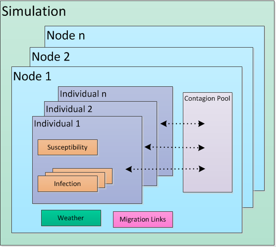
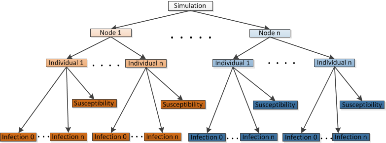

==========================
Simulation core components
==========================

The simulation component contains core functionality that models the behavior of a disease without any
interventions and extended functionality to include migration, climate, or other input data to
create a more realistic simulation. Disease transmission may be more or less complex depending on
the disease being modeled.

.. include:: reuse/warning-schema.txt

.. contents:: Content
   :local:

Each generic |EMOD_s| simulation contains the following core base classes:

Simulation
    Created by the simulation controller via a **SimulationFactory** with each run of |EMOD_s|.
Node
    Corresponds to a geographic area. Each simulation maintains a collection of one or more nodes.
IndividualHuman
    Represents a human being. Creates **Susceptibility** and **Infection** objects for
    the collection of individuals it maintains. The file name that defines this class is "Individual"
    and you may see it likewise shortened in diagrams.
Susceptibility
    Manages an individual's immunity.
Infection
    Represents an individual's infection with a disease.

For generic simulations, each node has a homogeneous contagion pool. Every individual in the
node sheds disease into the pool and acquires disease from the pool. You can add heterogeneous
disease transmission within a node by enabling and configuring the :term:`Heterogeneous Intra-Node
Transmission (HINT)` feature. For more information, see :doc:`model-hint`.

The relationship between these classes is captured in the following figure.

   Simulation components

After the simulation is initialized, all objects in the simulation are updated at each time step,
typically a single day. Each object implements a method **Update** that advances the state of the
objects it contains, as follows:

* **Controller** updates **Simulation**
* **Simulation** updates **Nodes**
* **Node** updates **IndividualHuman**
* **IndividualHuman** updates **Susceptibility**, **Infections**, and **InterventionsContainer**
* **InterventionsContainer** updates **Interventions**

Simulation
==========

As a stochastic model, |EMOD_s| uses a random number seed for all simulations. The **Simulation**
object has a data member (RNG) that is an object maintaining the state of the random number
generator for the parent **Simulation** object. The only generator currently supported is
pseudo-DES. The random seed is initialized from the configuration parameter **Run_Number** and from the
process MPI rank. All child objects needing access to the RNG must be provided an appropriate
(context) pointer by their owners.

The **Simulation** class contains the following methods:

.. list-table::
    :widths: 5, 20
    :header-rows: 1

    * - Method
      - Description
    * - Populate()
      - Initializes the simulation. The **Populate** method initializes the simulation using
        both the configuration file and the demographic files. **Populate** calls through to
        **populateFromDemographics** to enable the **Simulation** object to create one or many **Node**
        objects populated with **IndividualHumans** as dictated by the demographics file, in conjunction with the
        sampling mode and value dictated by the configuration file. If the configuration file indicates that
        a migration and a climate model are to be used, those input file are also read. **Populate** also
        initializes all **Reporters**.
    * - Update()
      - Advances the state of nodes.

   Simulation object hierarchy

For multi-core parallelization, the demographics file is read in order on each process and identity
of each node and is compared with a policy assigning nodes to processes embodied in objects
implementing **InitialLoadBalancingScheme**. If the initial load balancing scheme allows a node for
the current rank, the node is created via **addNewNodeFromDemographics**. After all nodes have been
created and propagated, the **NodeRankMaps** are merged across all processes. See
:doc:`software-load-balancing` for more information.

Node
====

Nodes are model abstractions that represent a population of individuals that interact in a way that
does not depend on their geographic location. However, they represent a geographic location with
latitude and longitude coordinates, climate information, migration links to other nodes, and
miscellaneous demographic information. The **Node** is always the container for **IndividualHumans** and
the contagion pool. The **Node** provides important capabilities for how **IndividualHumans** are created
and managed. It can also contain a **Climate** object and **Migration** links if those features are
enabled. The climate and migration settings are initialized based on the information in the input
data files.

The **Node** class contains the following methods:

.. list-table::
    :widths: 5, 20
    :header-rows: 1

    * - Method
      - Description
    * - PopulateFromDemographics()
      - The entry point that invokes **populateNewIndividualsFromDemographics(InitPop)**, which adds
        individuals to a simulation and initializes them. **PopulateNewIndividualsFromBirth()**
        operates similarly, but can use different distributions for demographics and initial infections.
    * - Update()
      - Advances the state of individuals.
    * - updateInfectivity()
      - The workhorse of the simulation, it processes the list of all individuals attached to the **Node**
        object and updates the force of infection data members in the contagion pool object. It calls a
        base class function **updatePopulationStatistics**, which processes all individuals, sets the counters
        for prevalence reporting, and calls **IndividualHuman::GetInfectiousness** for all **IndividualHuman** objects.

        The code in **GetInfectiousness** governs the interaction of the **IndividualHuman** with the contagion
        pool object. The rest of the code in **updateInfectivity** processes the contagion beyond individual
        contributions. This can include decay of persisting contagion, vector population dynamics,
        seasonality, etc. This is also where the population-summed infectivity must be scaled by the
        population in the case of density-independent transmission.
    * - updateVitalDynamics()
      - Manages community level vital dynamics, primarily births, since deaths occur at the individual level.

By default, an **IndividualHuman** object is created, tracked, and updated for every person within a
node. To reduce memory usage and processing time, you may want to sample such that each
**IndividualHuman** object represents multiple people. There are several different sampling strategies
implemented, with different strategies better suited for different simulations. See
:doc:`parameter-configuration-sampling` for more information.

If migration is enabled, at the end of the **Node** update, the **Node** moves all migrating
individuals to a separate migration queue for processing. Once the full simulation time step is
completed, all migrating individuals are moved from the migration queue and added to their
destination nodes.

IndividualHuman
===============

The **IndividualHuman** class corresponds to human beings within the simulation. Individuals are always
contained by a **Node** object. Each **IndividualHuman** object may represent one or more human beings,
depending on the sampling strategy and value chosen.

The **IndividualHuman** class contains components for susceptibility, infection, and interventions.
**Infection** and **Susceptibility** cooperate to represent the detailed dynamics of infection and
immune mechanisms. Every **IndividualHuman** contains a **Susceptibility** object that represents the
state of the immune system over time. Only an infected **IndividualHuman** contains an **Infection**
object, and may contain  multiple **Infection** objects.. **Susceptibility** is passed to initialize
the infection immunology in **Infection::InitInfectionImmunology()**. The state of an individual's
susceptibility and infection are updated with **Update()** methods. Disease-specific models have
additional derived classes with properties and methods to represent specifics of the disease biology.

The **InterventionsContainer** is the mediating structure for how interventions interrupt disease
transmission or progression. Campaign distribution results in an **Intervention** object being added
to an individual’s **InterventionsContainer**, where it remains unless and until it is removed. When
an **IndividualHuman** calls **Update()**, the **InterventionsContainer** is updated and its effects are
applied to the **IndividualHuman**. These effects are used in the individual, infection, and
susceptibility update operations. If migration is enabled, at the end of each individual’s update
step |EMOD_s| checks if the individual is scheduled for migration
(**IndividualHuman::CheckForMigration()**), setting a flag accordingly.

The **IndividualHuman** class contains the following methods:

.. list-table::
    :widths: 5, 20
    :header-rows: 1

    * - Method
      - Description
    * - Update()
      - Advances the state of both the infection and the immune system and then registers any necessary
        changes in an individual's state resulting from those dynamics (that is, death, paralysis,
        or clearance). It also updates intrinsic vital dynamics, intervention effects, migration,
        and exposure to infectivity of the appropriate social network.
    * - ExposeToInfectivity()
      - Passes the **IndividualHuman** to the **ExposeIndividual()** function if it is exposed to infectivity
        at a time step.
    * - UpdateInfectiousness()
      - Advances the quantity of contagion deposited to the contagion pool by an **IndividualHuman** at
        each time step of their infectious period. This is explained in more detail below.

.. _arch-transmission:

Disease transmission
--------------------

Transmission of disease is mediated through a pool mechanism which tracks abstract quantities of
contagion. The pool mediates individual acquisition and transmission of infections as well as
external processes that modify the infectivity dynamics external to individuals. The pool provides
basic mechanisms for depositing, decaying, and querying quantities of contagion which are associated
with a specific **StrainIdentity**. The pool internally manages a separate **ContagionPopulation**
for each possible antigen identity. **ContagionPopulations** have further structure and manage an
array of contagion quantities for each substrain identity.

Each **IndividualHuman** has a sampling weight :math:`W_i` and a total infectiousness :math:`X_i`, the
rate at which contacts with the infectious individual become infected. This rate can be modified by
transmission-reducing immunity or heterogeneous contact rates, which are gathered in
:math:`Y_{i,transmit}`, and the transmission-reducing effects of interventions, such as
transmission- blocking vaccines in the factor :math:`Z_{i,transmit}`. The sampling weight
:math:`W_i` is not included in the probability of acquiring a new infection. Sample particles are
simulated as single individuals, their weighting :math:`W_i` is used to determine their effects upon
the rest of the simulation.The total infectiousness :math:`T` of the local human population is then
calculated as:

.. math::

    T = \sum_iW_iX_iY_{i,transmit}Z_{i,transmit}

For simulation of population density-independent transmission, individual infectiousness :math:`X_i`
includes the average contact rate of the infectious individual, so this total infectiousness is
divided by the population :math:`P` to get the force of infection :math:`FI=\frac{T}{P}` for each
individual in the population. The base rate of acquisition of new infections per person is then
:math:`FI`, which can be modified for each individual :math:`I` by their characteristics
:math:`Y_{i,acquire}` and interventions :math:`Z_{i,acquire}`. Over a time step :math:`\Delta t`,
the probability of an individual acquiring a new infection is then:

.. math::

    P_{I,i} = 1- \text{exp}(-F_IY_{i,acquire}Z_{i,acquire}\Delta t)

A new infection receives an incubation period and infectious period from the input configuration (a
constant at present, but possibly from specified distributions in the future) and a counter tracks
the full latency, which is possible when simulating individual particles. After the incubation
period, the counter for the infectious period begins, during which time the infection contributes to
the individual’s infectiousness :math:`X_i`.
