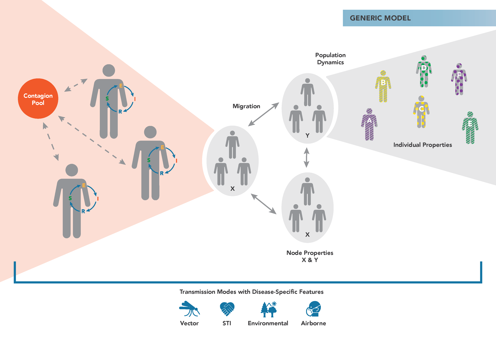

=======================
Generic model overview
=======================

The |EMOD_s| generic model forms the foundation for all other disease models in |EMOD_s|. It
provides the fundamental logic for contact-based disease transmission and interventions aimed at
controlling the spread of disease that are targeted to individuals or geographic nodes. You can
easily add heterogeneity to your simulation by configuring he infectivity of the disease,
susceptibility of individuals, and more. The generic model does not contain logic for disease
biology, but it can be configured to model a variety of diseases, such as influenza, Ebola, measles,
and more. To use the generic model, set the configuration parameter **Simulation_Type** to
GENERIC_SIM.

The figure below demonstrates the main components of the generic |EMOD_s| :term:`simulation type`.
Individuals reside in geographic nodes and can migrate from one node to another. Infected
individuals shed contagion into a pool that can infect susceptible individuals. You can assign
properties to individuals and nodes to vary how transmission or interventions occur.

In the generic model, you can add heterogeneous transmission in a population using the |HINT_l|
feature. Using this feature, you assign different properties to individuals in a population and
differentially scale the infectivity from one group to another. For example, you might have high
infectivity between schoolchildren and lower infectivity from the elderly to children. For more
information,  see :doc:`model-hint`. This feature is not available in most other
disease models, where heterogeneity in transmission is handled more mechanistically. For example,
the malaria model simulates parasite density, mosquito populations, and biting frequency.

If you are familiar with compartmental models but new to agent-based models, we recommend reviewing
the :doc:`model-compartments` section, which compares the mathematics of the
differential equations that govern compartmental models with the mathematics of the |EMOD_s|
agent-based model. It describes how to configure |EMOD_s| to model diseases like SI, SIR, or SEIR
models. Additionally, review :doc:`tutorials` for hands-on experience running |EMOD_s|
simulations.

The configuration of the model regarding infectivity, immune response, and other qualities is
handled via several :term:`JSON (JavaScript Object Notation)` files. For more information, see
:doc:`software-overview`.

.. toctree::

    model-compartments
    model-outbreak
    model-heterogeneity
    model-campaign

.. _Epidemics: https://www.coursera.org/learn/epidemics/home/welcome