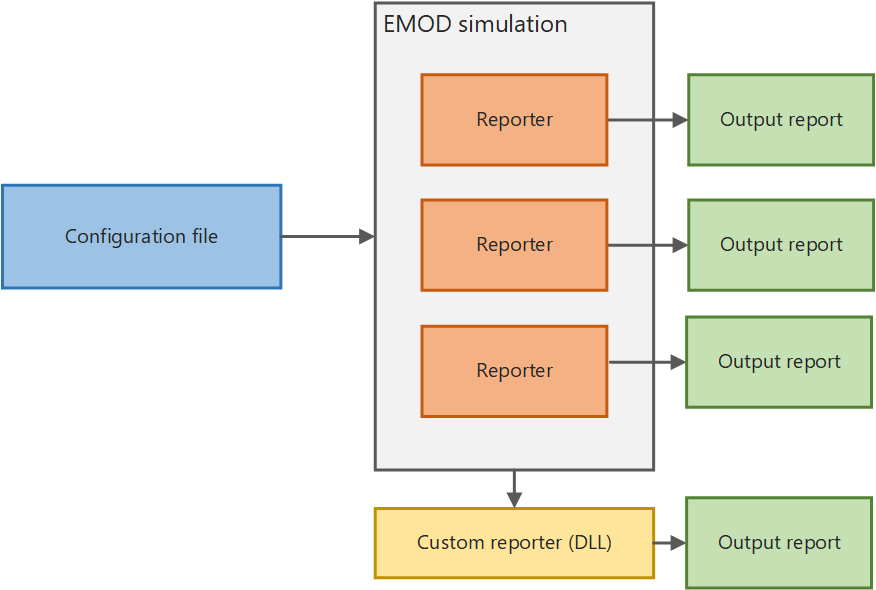

# Output files (reports)

After the simulation finishes, a **reporter** extracts simulation data, aggregates it, and outputs it to a file (known as an **output report**). Most of the reports are also JSON files,
the most important of which is InsetChart.json. The InsetChart.json file provides simulation-wide
averages of disease prevalence at each **time step**.

After running a simulation, the simulation data is extracted, aggregated, and saved as an
**output report** to the output directory in the working directory. Depending on your
configuration, one or more output reports will be created, each of which summarize different data
from the simulation. Output reports can be in JSON, CSV, or binary file formats. EMOD also
creates logging or error output files.

The EMOD functionality that produces an output report is known as a **reporter**. EMOD
provides several built-in reporters for outputting data from simulations. By default, EMOD will
always generate the report InsetChart.json, which contains the simulation-wide average disease
prevalence by **time step**. If none of the provided reports generates the output report that
you require, you can create a custom reporter.

If you want to visualize the data output from an EMOD simulation, you must use graphing
software to plot the output reports. In addition to output reports, EMOD will generate error
and logging files to help troubleshoot any issues you may encounter.

## Using output reports

By default, the output report InsetChart.json is always produced, which contains per-
time step values accumulated over the simulation in a variety of reporting channels, such as new infections,
prevalence, and recovered. EMOD provides several other
built-in reports that you can produce if you enable them in the **configuration file** with the [parameter-configuration-output](../md_parameter/parameter-configuration-output.md) parameters. Reports are generally in JSON or CSV format.
If none of the built-in output reports provide the data you need, you can use a custom reporter that
plugs in to the Eradication.exe as an EMODule **dynamic link library (DLL)**. For more information, see [software-custom-reporter](software-custom-reporter.md).

In order to interpret the output of EMOD simulations, you will find it useful to parse the output
reports into an analyzable structure. For example, you can use a Python or MATLAB script to create graphs
and charts for analysis.

### Convert output to CSV format

Most output reports, including the primary InsetChart report, are in JSON format. If you are using R
for data analysis, you may prefer a CSV report. You can easily convert the output format using
Python post-processing using the icjjson2csv.py_ script provided in the EMOD GitHub repository.
Provide the path to this script using the `-P` argument when you run Eradication.exe at the command line. See [software-simulation-cli](software-simulation-cli.md) for more information.
