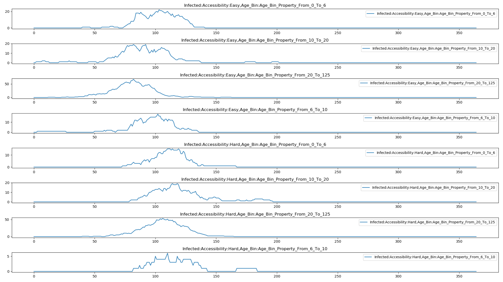
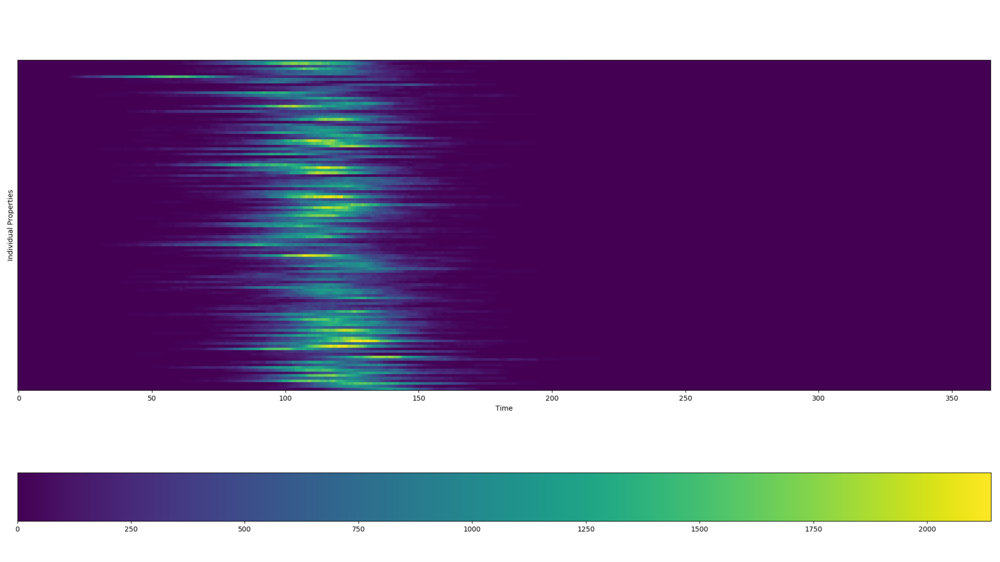

============================================================
Property-based heterogeneous disease transmission (|HINT_s|)
============================================================

By default, |EMOD_l| assumes disease transmission is homogeneous across a population within each
node when using the generic simulation type. That is, the population is sufficiently "well-
mixed" to make each individual equally likely to next encounter each other individual. Disease
transmission is configured by the parameter **Base_Infectivity**, which determines a single
transmission constant, :math:`\beta_0`, to calculate the transmission rate for each individual
within a node. These assumptions simplify the mathematical calculations that are performed when
running a :term:`simulation`.

However, assumptions of homogeneity quickly become invalid when considering the complexities of
disease transmission. Spatial effects, even at relatively small scales, can invalidate the well-
mixed assumption, particularly if the disease is highly infectious or the population density is
high. Non-uniform patterns of mixing based on age are well-documented in school-based disease
transmission [#f1]_. Susceptibility and infectivity are inherently heterogeneous, as governed by both
behavioral and biological factors including hand washing, viral load, and immunity. Many of these
factors can be targeted by interventions that potentially have non-uniform uptake, for example due
to differences in accessibility.

The |HINT_l| feature enables you to use individual properties (described more in :doc:`model-properties`)
to add heterogeneous transmission *within* nodes due to differences in risk,
accessibility, and more. Examples of individual properties, with typical values given
parenthetically, include risk group (low, medium, high), age group (under 5, 5 to 15, over 15),
vaccine accessibility class (easy, hard), intra-node locale (census tracts), and place (home,
school, work, community, non-school). All nodes in a :term:`simulation` must have the same
individual properties and values, but the characteristics of the heterogeneity can vary from
node to node.

Additionally, you can use |HINT_s| to approximate "contact scaling", a particular form
of heterogeneous mixing in which shedding and acquisition are symmetric. The best example of contact
scaling is location-based mixing, which can be used in place of intra-day migration.

This topic describes how to use the |HINT_s| feature to add heterogeneous transmission to your
generic model by defining population groups and the transmission rate between each of these
groups. It also describes the mathematics underpinning |HINT_s|.

How to configure |HINT_s|
=========================

#.  In the configuration file, set the following:

    *   **Enable_Heterogeneous_Intranode_Transmission** to 1.

    *   **Base_Infectivity** to your desired value.

#.  If you have not already added property values in the demographics file, add them using
    the steps in :doc:`model-properties`.
#.  In the demographics file, within each object in the **IndividualProperties** array, add the
    **TransmissionMatrix** parameter and assign it an empty JSON object.
#.  In the object, set the following:

    *   **Route** to the the transmission route (currently "Contact" is the only supported
        value).

    *   **Matrix** to an array that contains a transmission matrix
        that scales the base infectivity set in the configuration file. This matrix is described in
        more detail below.

Transmission matrix
===================

Associated with each individual property is a values-by-values-sized matrix of multipliers, denoted
:math:`\beta`, that scale base infectivity, :math:`\beta_0`. Specifically, the entry of the
multiplier matrix at row :math:`i` and column :math:`j` determines the transmission constant from
infected individuals having the :math:`i^{th}` value to susceptible individuals having the
:math:`j^{th}` value.

For example, the following demographics file configures |HINT_s| for transmission between individuals
in high-risk and low-risk groups.

.. literalinclude:: json/howto-hint1.json
   :language: json

Based on the order the property values are listed, the high-risk group is represented in the first
column and first row; the low-risk group is represented in the second column and second row. The
following matrix represents the direction of the disease transmission between the groups:

.. math::

        WAIFW = \begin{pmatrix}
        \text{high risk} \rightarrow \text{high risk} & \text{high risk} \rightarrow \text{low risk}\\
        \text{low risk} \rightarrow \text{high risk} & \text{low risk} \rightarrow \text{low risk}\\
        \end{pmatrix}

Two individual properties can be combined to achieve a higher level of transmission
heterogeneity. When multiple individual properties are configured, their effects are combined
*independently* via multiplication of the appropriate multipliers. In the following example, an
individual who is high risk and suburban will have the following transmission multiplier when
interacting with an individual who is a low risk and suburban: :math:`0.1 \times 1.4 = 0.14`.
Similarly, the transmission multiplier for a low risk  urban individual to a high risk rural
individual will be :math:`0.1 \times 0.2 = 0.02`.

.. literalinclude:: json/howto-hint2.json
   :language: json

While most multiplier matrices are symmetric, asymmetries as in the above
example can arise for several reasons including heterogeneity in susceptibility.

The product of the base infectivity, :math:`\beta_0`, and the multiplier matrix, :math:`\beta`,
governs "who acquires infection from whom," and thus is sometimes called the :term:`WAIFW matrix`. The
values in this matrix can be thought of as the "effective contact rate," where an *effective
contact* is defined as one that will result in disease transmission were it between a susceptible
and infected individual [#f2]_.

Detailed mathematics of |HINT_s|
================================

The following examples illustrate the mathematics behind the |HINT_s| feature in an |EMOD_s|
simulation.  Because |EMOD_s| represents individuals, and to be clear about mechanisms by which
the transmission rate varies as a function of the node population, we instead present the
dynamics in terms of the number of individuals (X, Y ,Z) in place of (S, I, R), respectively.
The examples below show the ODE form of the model with |HINT_s| enabled.

To review the mathematics underlying |EMOD_s| in a homogeneous node without |HINT_s| enabled,
see :doc:`model-compartments`. That topic includes a detailed comparison of compartmental models
and |EMOD_s|, including the equations used for both ODE models and |EMOD_s|.

|HINT_s| node with one individual property
------------------------------------------

To begin, consider a single node with one individual property having :math:`V`
values. The :math:`X`, :math:`Y`, and :math:`Z` disease states will gain an :math:`v` subscript to
index into the individual property values. Using the user-provided multiplier matrix of size
:math:`V \times V`, the ODE form of the disease dynamics are:

.. math::

    \frac{dX_v}{dt} &= \nu N - \sum^{V}_{k=1}\frac{\beta_0\beta_{k,v}}{N}X_v Y_k - \mu{X_v} \\
    \frac{dY_v}{dt} &= \sum^V_{k=1}\frac{\beta_0\beta_{k,v}}{N}X_vY_k - \gamma{Y_v} - \mu{Y_v} \\
    \frac{dZ_v}{dt} &= \gamma{Y_v} - \mu{Z_v}

For :math:`v \in [1...V]`.

At simulation initialization, individuals are assigned stochastically to values of the individual
property according to the distribution specified in the demographics file.

|HINT_s| node with multiple individual properties
-------------------------------------------------

When configured for multiple individual properties, |EMOD_s| assigns individual property values
to individuals *independently* based on the separate probability distributions provided by the
user in the demographics file. As an example, consider two individual properties, :math:`p_1`
and :math:`p_2`, having :math:`V_1` and :math:`V_2` values, respectively. The multiplier
matrices will be denoted :math:`\beta^{p_1}` and :math:`\beta^{p_2}`, and have sizes :math:`V_1
\times V_1` and :math:`V_2 \times V_2`, respectively. The resulting disease dynamics in ODE form
are:

.. math::

    \frac{dX_{v_1,v_2}}{dt} &= \nu N - \sum^{V_1}_{k_1=1} \sum^{V_2}_{k_2=1}\frac{\beta_0\beta^{p_1}_{k_1,v_1}\beta^{p_2}_{k_2,v_2}}{N}X_{v_1,v_2}Y_{k_1,k_2} - \mu{X_{v_1,v_2}} \\

    \frac{dI_{v_1,v_2}}{dt} &= \nu N - \sum^{V_1}_{k_1=1} \sum^{V_2}_{k_2=1}\frac{\beta_0\beta^{p_1}_{k_1,v_1}\beta^{p_2}_{k_2,v_2}}{N}X_{v_1,v_2}Y_{k_1,k_2} - \gamma{Y_{v_1,v_2}} - \mu{Y_{v_1,v_2}} \\

    \frac{dZ_{v_1,v_2}}{dt} &= \gamma{Y_{v_1,v_2}} - \mu{Z_{v_1,v_2}}

For indices :math:`(V_1,V_2) \in [1...V_1]\times[V_1...V_2]`.

The following graph show the property report for a |HINT_s| simulation with both age and
accessibility properties in which transmission is lower for hard to access individuals. There
are an equal number of "easy" and "hard" to access individuals, but notice how peak prevalence
is higher for individuals who are easy to access. To run this example simulation, see the
Generic/HINT_AgeAndAccess scenario in the downloadable `EMOD scenarios`_ zip file. This also includes examples that
show the effect of targeting vaccination to either a particular age group or accessibility
group. Review the README files there for more information.

   Figure 1: Baseline outbreak

Contact scaling
---------------

One potential application of |HINT_s| is in configuring "contact scaling," a particular form
of heterogeneous mixing in which shedding and acquisition are symmetric. The best example of contact
scaling is location-based mixing, which can be used in place of intra-day migration. Typical places
for location-based mixing include home, school, and work. Contact scaling could also be used for
mixing between age groups. The population at each of these different locations affect disease
transmission.

Contact scaling is typically specified by a matrix, :math:`C=[c_{ij}]`. The entry at
:math:`c_{ij}` indicates that an individual with value :math:`i` sheds and acquires from mixing pool
:math:`j` with weight :math:`c_{ij}`. Each row of the contact scaling matrix typically sums to one,
especially for location-based mixing wherein :math:`c_{ij}` can be used to represent the fraction of
the day an individual with value :math:`i` spends at location :math:`j`.

In terms of implementation, there is one main difference between contact scaling and transmission
scaling. In contact scaling, individuals both shed into and acquire from pools of contagion
according to the corresponding row of the :math:`C` matrix. Normalization is done not by :math:`N`,
as in frequency scaling, but instead by the "effective population" of each mixing pool, which is
computed as the :math:`C`-weighted sum of the population-by-value. Transmission scaling via the
:math:`\beta` matrix in |HINT_s| directly specifies the transmission rate per susceptible between each group of
individuals, so there is no concept of place but the overall approach is more flexible, e.g. by
allowing asymmetries.

Interestingly, contact scaling exhibits neither frequency-dependent nor density-dependent scaling,
although it more closely resembles frequency-dependent transmission because the denominator is a
function of the current population. Currently, contact scaling is not supported as an independent
feature in the |EMOD_s| software, however one can simulate contact scaling to good approximation if
the fraction of the population in each value :math:`n_i = \frac{N_i(t)}{N(t)}` is constant or
stabilizes quickly. Then the transmission matrix can be configured using,

.. math::

    \beta = C[\text{diag}(C^Tn)]^{-1}C^T

Here, :math:`n` is a :math:`V`-length column vector of the equilibrium fractions of the
population by value. Absent mortality factors or interventions moving individuals from one value
to the next, :math:`n` should be close to the probability distribution used to assign values to
individuals.

The following graph show the property report for a |HINT_s| simulation that uses different
property values for each census tract in Seattle to simulate daily commutes as an example of
contact scaling. An influenza outbreak begins in census tract 7 and the spatial coupling of the
intra-day migration allows the disease to spread across the rest of the city. To run this
example simulation, see the Generic/HINT_SeattleCommuting scenario in the `EMOD scenarios`_ zip file.

   Figure 2: Effect of daily commutes on disease spread

.. [#f1] J. Mossong, N. Hens, M. Jit, P. Beutels, K. Auranen, R. Mikolajczyk, M. Massari, S. Salmaso, G. S. Tomba, J. Wallinga, et al. Social contacts and mixing patterns relevant to the spread of infectious diseases. PLos medicine, 5(3):e74, 2008.

.. [#f2] M.J. Keeling and P. Rohani. *Modeling infectious diseases in humans and animals*. Princeton University Press, 2008.

.. _EMOD scenarios: https://github.com/InstituteforDiseaseModeling/docs-emod-scenarios/releases

