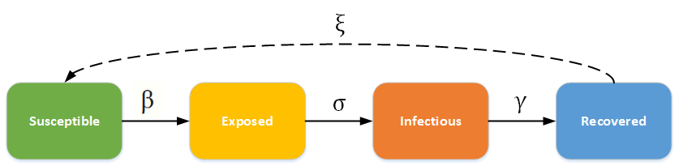

=====================
SEIR and SEIRS models
=====================

This topic describes the differential equations that govern the classic deterministic SEIR and SEIRS
compartmental models and describes how to configure |EMOD_s|, an agent-based stochastic model, to
simulate an SEIR/SEIRS epidemic. In this category of models, individuals experience a long
incubation duration (the "exposed" category), such that the individual is *infected* but not yet
*infectious*. For example chicken pox, and even vector-borne diseases such as dengue hemorrhagic
fever have a long incubation duration where the individual cannot yet transmit the pathogen to
others.

The SEIR/SEIRS diagram below shows how individuals move through each compartment in the model. The dashed line shows how the SEIR model becomes an SEIRS (Susceptible - Exposed - Infectious
- Recovered - Susceptible) model, where recovered people may become susceptible again (recovery does
not confer lifelong immunity). For example, rotovirus and malaria are diseases with long incubation
durations, and where recovery only confers temporary immunity.

  SEIR - SEIRS model

The infectious rate, :math:`\beta`, controls the rate of spread which represents the probability of
transmitting disease between a susceptible and an infectious individual. The incubation rate,
:math:`\sigma`, is the rate of latent individuals becoming infectious (average duration of incubation
is 1/:math:`\sigma`). Recovery rate, :math:`\gamma` = 1/D, is determined by the average duration, D,
of infection. For the SEIRS model, :math:`\xi` is the rate which recovered individuals return to the
susceptible state due to loss of immunity.

.. contents:: Contents
   :local:

SEIR model
==========

Many diseases have a latent phase during which the individual is infected but not yet infectious.
This delay between the acquisition of infection and the infectious state can be incorporated within
the SIR model by adding a latent/exposed population, E, and letting infected (but not yet
infectious) individuals move from S to E and from E to I. For more information, see
:doc:`parameter-configuration-incubation` parameters.

SEIR without vital dynamics
---------------------------

In a closed population with no births or deaths, the SEIR model becomes:

.. math::

        \begin{aligned}
        \frac{dS}{dt} & = -\frac{\beta SI}{N}\\
        \frac{dE}{dt} & = \frac{\beta SI}{N} - \sigma E\\
        \frac{dI}{dt} & = \sigma E - \gamma I\\
        \frac{dR}{dt} & = \gamma I
        \end{aligned}

where :math:`N = S + E + I + R` is the total population.

Since the latency delays the start of the individual's infectious period, the secondary spread from
an infected individual will occur at a later time compared with an SIR model, which has no latency.
Therefore, including a longer latency period will result in slower initial growth of the outbreak.
However, since the model does not include mortality, the basic :term:`reproductive number`,
R\ :sub:`0`\  = :math:`\beta/\gamma`, does not change.

The complete course of outbreak is observed. After the initial fast growth, the epidemic depletes
the susceptible population. Eventually the virus cannot find enough new susceptible people and dies
out. Introducing the incubation period does not change the cumulative number of infected
individuals.

The following graphs show the :term:`inset chart` and charts for all channels in a couple typical
SEIR outbreaks, one with an incubation period of 8 days and one with an incubation period of 2 days.
Notice how the outbreak depletes the susceptible population more quickly when the incubation period
is shorter but that the cumulative infections remains the same. To run this example simulation, see
the Generic/SEIR scenario in the downloadable `EMOD scenarios`_ zip file. Review the README files there for more
information.

   Figure 1: SEIR epidemic course for 8-day incubation period

   Figure 2: All output channels for SEIR 8-day incubation period

   Figure 3: SEIR epidemic course for 2-day incubation period

   Figure 4: All output channels for SEIR 2-day incubation period

SEIR with vital dynamics
------------------------

As with the SIR model, enabling vital dynamics (births and deaths) can sustain an epidemic or allow
new introductions to spread because new births provide more susceptible individuals. In a realistic
population like this, disease dynamics will reach a steady state. Where :math:`\mu` and :math:`\nu`
represent the birth and death rates, respectively, and are assumed to be equal to maintain a
constant population, the ODE then becomes:

.. math::

        \begin{aligned}
        \frac{dS}{dt} & = \mu N - \nu S - \frac{\beta SI}{N}\\
        \frac{dE}{dt} & = \frac{\beta SI}{N} - \nu E - \sigma E\\
        \frac{dI}{dt} & = \sigma E - \gamma I - \nu I\\
        \frac{dR}{dt} & = \gamma I - \nu R
        \end{aligned}

where :math:`N = S + E + I + R` is the total population.

The following graphs show periodic reintroductions of an SEIR outbreak in a population with vital
dynamics. To run this example simulation, see the Generic/SEIR_VitalDynamics scenario in the `EMOD scenarios`_ folder.
Review the README files there for more information.

   Figure 5: SEIR periodic outbreaks on reintroduction in a population with vital dynamics

   Figure 6: All output channels for SEIR outbreaks

SEIRS model
===========

The :term:`SEIR model` assumes people carry lifelong immunity to a disease upon recovery, but for many diseases the immunity after infection wanes over time. In this case, the SEIRS model is used to allow
recovered individuals to return to a susceptible state. Specifically, :math:`\xi` is the rate which recovered
individuals return to the susceptible statue due to loss of immunity. If there is sufficient influx
to the susceptible population, at equilibrium the dynamics will be in an endemic state with damped
oscillation. The SEIRS ODE is:

.. math::

        \begin{aligned}
        \frac{dS}{dt} & = -\frac{\beta SI}{N} + \xi R\\
        \frac{dE}{dt} & = \frac{\beta SI}{N} - \sigma E\\
        \frac{dI}{dt} & = \sigma E - \gamma I\\
        \frac{dR}{dt} & = \gamma I - \xi R
        \end{aligned}

where :math:`N = S + E + I + R` is the total population.

|EMOD_s| simulates waning immunity by a delayed exponential distribution. Individuals
stay immune for a certain period of time then immunity wanes following an exponential distribution.
For more information, see :doc:`parameter-configuration-immunity` parameters.

SEIRS with vital dynamics
-------------------------

You can also add vital dynamics to an SEIRS model, where :math:`\mu` and :math:`\nu` again represent
the birth and death rates, respectively. To maintain a constant population, assume that
:math:`\mu = \nu`. In steady state :math:`\frac{dI}{dt} = 0`. The ODE then becomes:

.. math::

      \frac{dS}{dt} & = \mu N - \frac{\beta S I}{N} + \xi R- \nu S\\
      \frac{dE}{dt} & = \frac{\beta S I}{N} - \sigma E - \nu E\\
      \frac{dI}{dt} & = \sigma E - \gamma I - \nu I\\
      \frac{dR}{dt} & = \gamma I - \xi R - \nu R

where :math:`N = S + E + I + R` is the total population.

The following graphs show the complete trajectory of a fatal SEIRS outbreak: the disease endemicity
due to vital process and waning immunity and the effect of vaccination campaigns that eradicate the
outbreak after day 500. To run this example simulation, see the Generic/SEIRS scenario in the downloadable
`EMOD scenarios`_ zip file. Review the README files there  for more information. For more information on
creating campaigns, see :doc:`model-campaign`.

   Figure 7: Trajectory of the SEIRS outbreak

   Figure 8: All output channels for SEIRS outbreak

.. _EMOD scenarios: https://github.com/InstituteforDiseaseModeling/docs-emod-scenarios/releases
