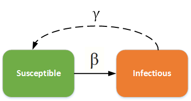
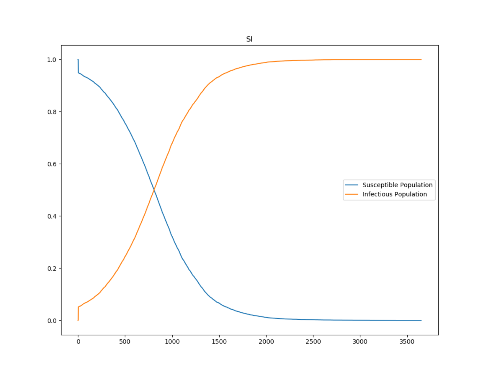
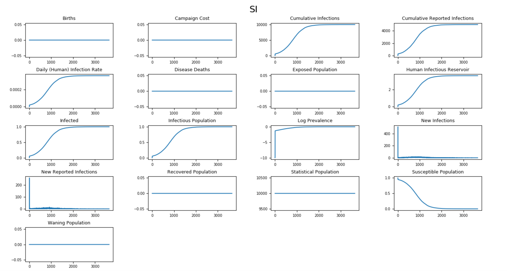
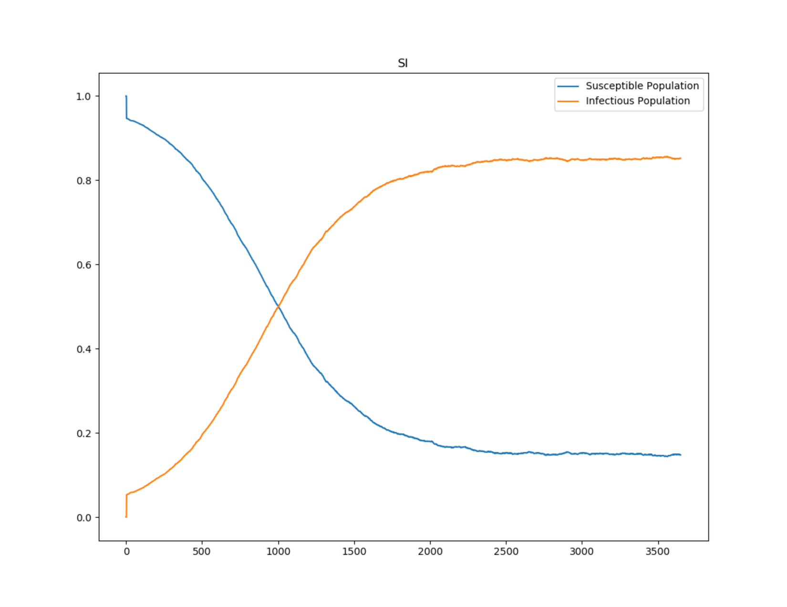
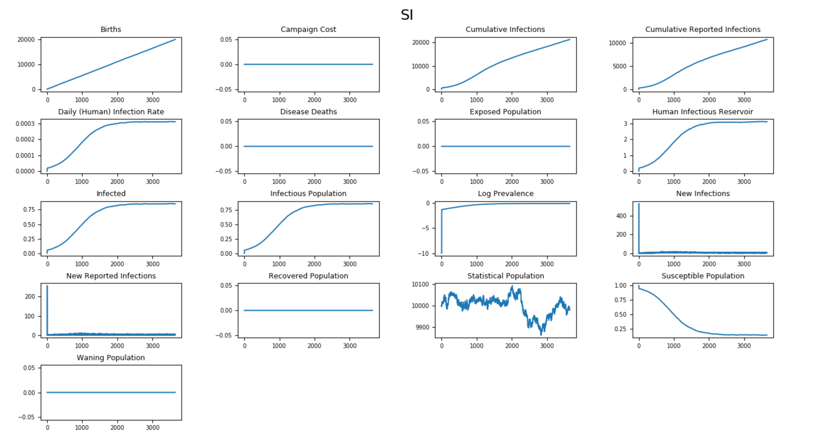
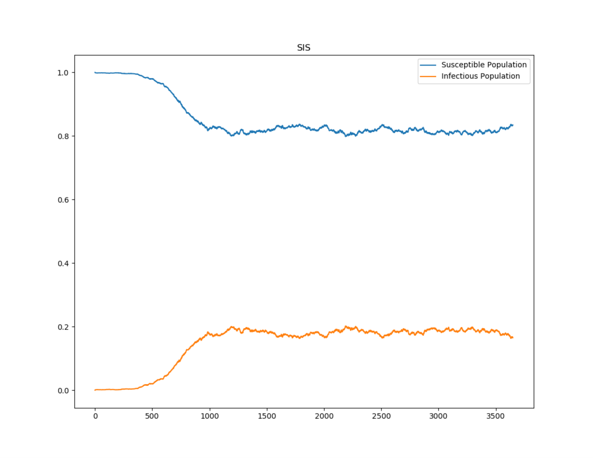
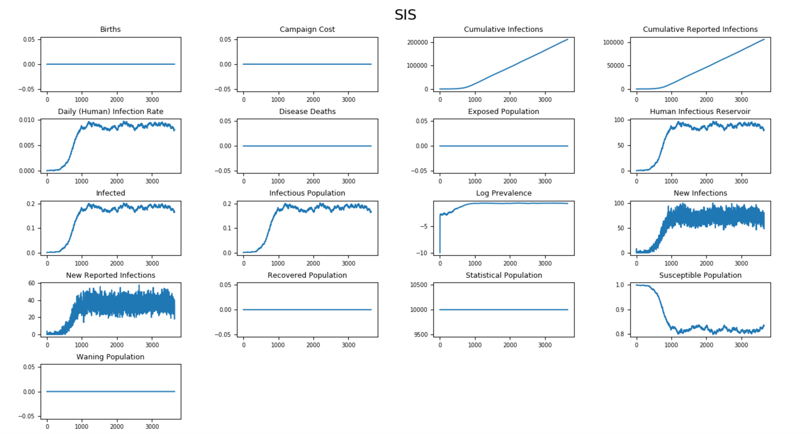

=================
SI and SIS models
=================

This topic describes the differential equations that govern the classic deterministic SI and SIS
compartmental models and describes how to configure |EMOD_s|, an agent-based stochastic model, to
simulate an SI/SIS epidemic. In SI models, people never leave the infectious state and have
lifelong infections. For example, herpes is a disease with lifelong infectiousness.

The SI/SIS diagram below shows how individuals move through each compartment in the model. The dashed line
shows how the model becomes an SIS (Susceptible - Infectious - Susceptible) model, where infection
does not confer immunity (or there is waning immunity). Individuals have repeat or reoccurring
infections, and infected individuals return to the susceptible state. For example, sexually
transmitted diseases such as gonorrhea or chlamydia fall into this group.

  SI - SIS model

The infectious rate, :math:`\beta`, controls the rate of spread which represents the probability of
transmitting disease between a susceptible and an infectious individual. Recovery rate,
:math:`\gamma` = 1/D, is determined by the average duration, D, of infection.

.. contents:: Contents
   :local:

SI model
========

The :term:`SI model` is the simplest form of all disease models. Individuals are born
into the simulation with no immunity (susceptible). Once infected and with no treatment, individuals
stay infected and infectious throughout their life, and remain in contact with the susceptible
population. This model matches the behavior of diseases like cytomegalovirus (CMV) or herpes.

SI without vital dynamics
-------------------------

The dynamics of I in a SI model are also known as logistic growth. If there are no vital processes
(birth and death), every susceptible will eventually become infected. The |EMOD_s| generic
simulation uses an SEIR model by default. However, it can be modified to an SI model by turning off
incubation and setting the infectious period to be longer than a human lifespan.

The SI model can be written as the following :term:`ordinary differential equation (ODE)`:

.. math::

        \begin{aligned}
        \frac{dS}{dt} & = -\frac{\beta SI}{N}\\
        \frac{dI}{dt} & = \frac{\beta SI}{N} = \beta I \left(1-\frac{I}{N}\right)
        \end{aligned}

where :math:`N = S + I` is the total population.

The following graphs show the :term:`inset chart` and charts for all channels in an SI simulation
without vital dynamics. To run this example simulation, see the Generic/SI scenario in the
downloadable `EMOD scenarios`_ folder and set **Enable_Vital_Dynamics** to 0. Review the README files there
for more information.

   Figure 1: SI outbreak showing logistic grown

   Figure 2: All output channels for an SI outbreak

SI with vital dynamics
----------------------

To add vital dynamics to a population, let :math:`\mu` and :math:`\nu` represent the birth and death
rates, respectively, for the model. To maintain a constant population, assume that :math:`\mu =
\nu`. Therefore, the ODE becomes:

.. math::

        \begin{aligned}
        \frac{dS}{dt} & = \mu N - \frac{\beta SI}{N} - \nu S\\
        \frac{dI}{dt} & = \frac{\beta SI}{N} - \nu I
        \end{aligned}

where :math:`N = S + I` is the total population.

The final proportion of infected people is related to both the vital dynamics and :math:`\beta`.
:math:`\beta` can be calculated by looking at the steady state:

.. math::

        \mu = \nu = \frac{\beta S}{N} = \beta \left(1 - \frac{I}{N}\right)

The following graphs show the inset chart and charts for all channels in the Generic/SI scenario when
vital dynamics remains on. The anticipated final epidemic size, :math:`I/N`, is 85%, and the birth
and death rate equals 0.0000548 per day (2% per year). Therefore, :math:`\beta` = 0.00003653.

   Figure 3: SI outbreak approaching 85% infected population at steady state

   Figure 4: All output channels for an SI outbreak with vital dynamics

SIS
===

Similar to the :term:`SIRS model`, the infected individuals return to the susceptible state after
infection. This model is appropriate for diseases that commonly have repeat infections, for example,
the common cold (rhinoviruses) or sexually transmitted diseases like gonorrhea or chlamydia.

The generic simulation type uses an :term:`SEIR model` by default. However, it can be modified
to an SIS model by configuration no incubation period and no immunity. For more
information, see :doc:`parameter-configuration-incubation` and :doc:`parameter-configuration-immunity` parameters.

SIS without vital dynamics
--------------------------

Because individuals remain susceptible after infection, the disease attains a steady state in a
population, even without vital dynamics. The ODE for the SIS model without vital dynamics can be
analytically solved to understand the disease dynamics. The ODE is as follows:

.. math::

        \begin{aligned}
        \frac{dS}{dt} & = -\frac{\beta SI}{N} + \gamma I\\
        \frac{dI}{dt} & = \frac{\beta SI}{N}  - \gamma I\\
        \end{aligned}

At equilibrium, solving:

.. math::

        \frac{dI}{dt} = \beta I \left(1-\frac{I}{N}\right) - \gamma I = 0

There are two equilibrium states for the SIS model, the first is :math:`I = 0` (disease free state),
and the second is:

.. math::

        I = \frac{(\beta - \gamma)N}{\beta} = \left(1-\frac{\gamma}{\beta}\right)N

For disease to spread, :math:`dI/dt > 0`. Therefore, similar to the previously described concept of
the basic :term:`reproductive number`, when :math:`\beta/\gamma > 1`, the disease will spread and
approach the second steady state; otherwise, it will eventually reach the disease-free state.

The following graphs show the :term:`inset chart` and charts for all channels in an SIS simulation
without vital dynamics that eventually approaches steady state. You can compare the fraction of
infected people with the anticipated value based on the previous calculation. If we have a
reproductive number of 1.2, the infected fraction at equilibrium will be 1 - (1/1.2) ~ 17%.

To run this example simulation, see the Generic/SIS scenario in the `EMOD scenarios`_ zip file.
Review the README files there for more information.

   Figure 5: SIS outbreak approaching 17% infected population at steady state

   Figure 6: All output channels for an SIS outbreak without vital dynamics

SIS with vital dynamics
-----------------------

To add vital dynamics to a population, let :math:`\mu` and :math:`\nu` represent the birth and death
rates, respectively, for the model. To maintain a constant population, assume that :math:`\mu =
\nu`. Therefore, the ODE becomes:

.. math::

    \frac{dS}{dt} & = \mu N -\frac{\beta S I}{N} + \gamma I - \nu S\\
    \frac{dI}{dt} & = \frac{\beta S I}{N} - \gamma I - \nu I

.. _EMOD scenarios: https://github.com/InstituteforDiseaseModeling/docs-emod-scenarios/releases
