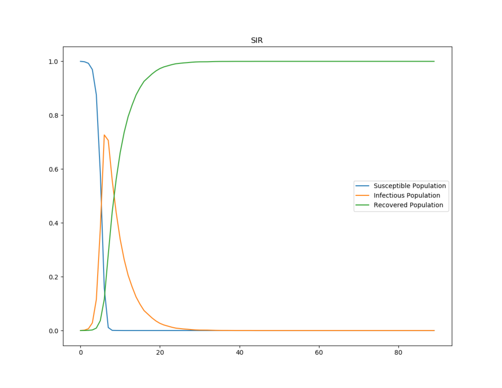
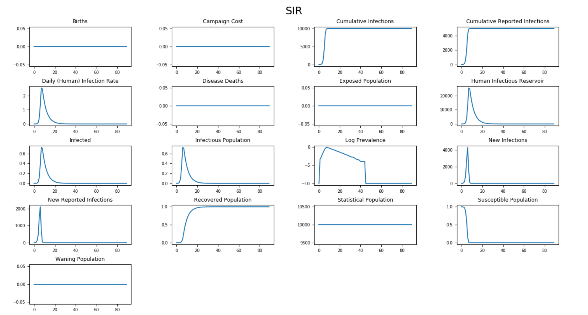
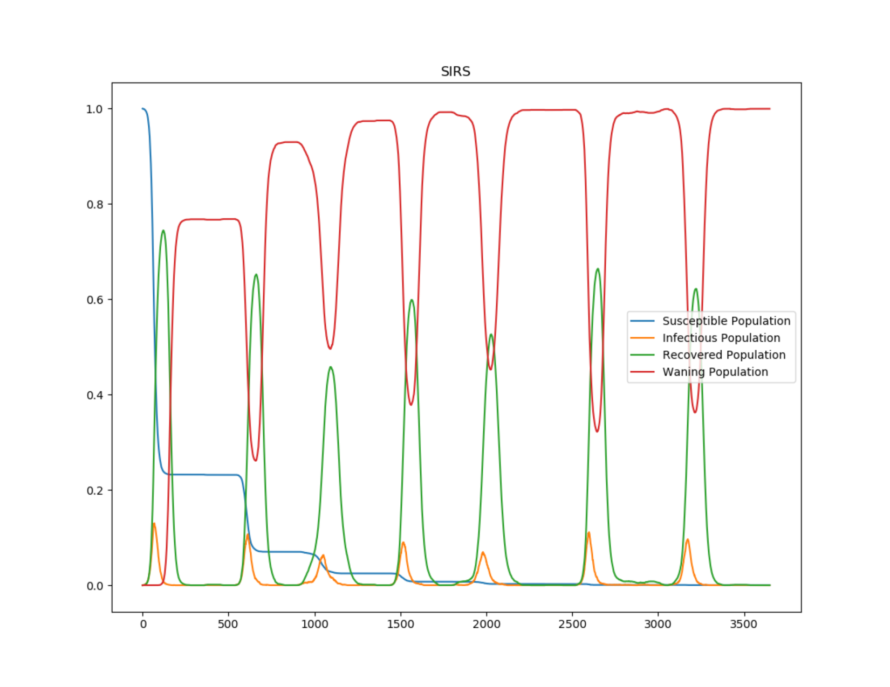
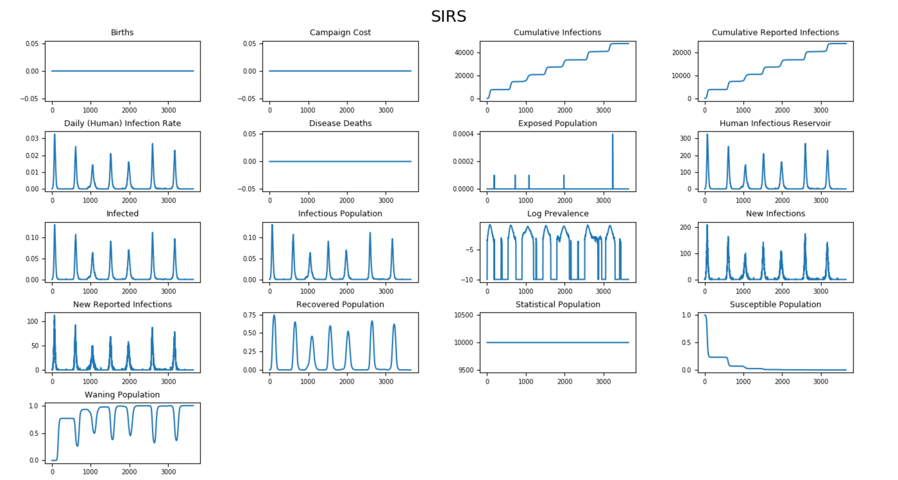

===================
SIR and SIRS models
===================

This topic describes the differential equations that govern the classic deterministic SIR and SIRS
compartmental models and describes how to configure |EMOD_s|, an agent-based stochastic model, to
simulate an SIR/SIRS epidemic. In SIR models, individuals in the recovered state gain total immunity
to the pathogen; in SIRS models, that immunity wanes over time and individuals can become
reinfected. The |EMOD_s| generic simulation uses an SEIR-like disease model by default. You can
modify the default SEIR model to an SIR model by turning off the incubation period.

The SIR/SIRS diagram below shows how individuals move through each compartment in the model. The
dashed line shows how the SIR model becomes an SIRS (Susceptible - Infectious - Recovered -
Susceptible) model, where recovery does not confer lifelong immunity, and individuals may become
susceptible again.

.. figure:: images/general/SIR-SIRS.png

  SIR - SIRS model

The infectious rate, :math:`\beta`, controls the rate of spread which represents the probability of
transmitting disease between a susceptible and an infectious individual. Recovery rate,
:math:`\gamma` = 1/D, is determined by the average duration, D, of infection. For the SIRS model,
:math:`\xi` is the rate which recovered individuals return to the susceptible statue due to loss of
immunity.

For a detailed comparison of how the SIR :term:`ordinary differential equation (ODE)` can be
rewritten in the stochastic |EMOD_s| model, see :doc:`model-compartments`.

.. contents:: Contents
   :local:

SIR model
=========

The :term:`SIR model` was first used by Kermack and McKendrick in 1927 and has subsequently been
applied to a variety of diseases, especially airborne childhood diseases with lifelong immunity upon
recovery, such as measles, mumps, rubella, and pertussis. S, I and R represent the number of
susceptible, infected, and recovered individuals, and N = S + I + R is the total population.

SIR without vital dynamics
--------------------------

If the course of the infection is short (emergent outbreak) compared with the lifetime of an
individual and the disease is non-fatal, vital dynamics (birth and death) can be ignored. In the
deterministic form, the SIR model can be written as the following ordinary differential equation
(ODE):

.. math::

        \begin{aligned}
        \frac{dS}{dt} & = -\frac{\beta SI}{N}\\
        \frac{dI}{dt} & = \frac{\beta SI}{N} - \gamma I\\
        \frac{dR}{dt} & = \gamma I
        \end{aligned}

where :math:`N = S + I + R` is the total population.

In a closed population with no vital dynamics, an epidemic will eventually die out due to an
insufficient number of susceptible individuals to sustain the disease. Infected individuals who are
added later will not start another epidemic due to the lifelong immunity of the existing population.

The following graphs show the :term:`inset chart` and charts for all channels in a typical SIR
outbreak. To run this example simulation, see the Generic/SIR scenario in the downloadable `EMOD scenarios`_
zip file. Review the README files there for more information.

   Figure 1: Growth of infection and depletion of the susceptible population in an SIR outbreak

   Figure 2: All output channels for SIR without vital dynamics

SIR with vital dynamics
-----------------------

However in a population with vital dynamics, new births can provide more susceptible individuals to
the population, sustaining an epidemic or allowing new introductions to spread throughout the
population. In a realistic population like this, disease dynamics will reach a steady state. This is
the case when diseases are endemic to a region.

Let :math:`\mu` and :math:`\nu` represent the birth and death rates, respectively, for the model. To
maintain a constant population, assume that :math:`\mu = \nu`. In steady state
:math:`\frac{dI}{dt} = 0`. The ODE then becomes:

.. math::

        \begin{aligned}
        \frac{dS}{dt} & = \mu N -\frac{\beta S I}{N} - \nu S\\
        \frac{dI}{dt} & = \frac{\beta S I}{N} - \gamma I - \nu I\\
        \frac{dR}{dt} & = \gamma I - \nu R
        \end{aligned}

where :math:`N = S + I + R` is the total population.

SIRS model
==========

The SIR model assumes people carry lifelong immunity to a disease upon recovery; this is
the case for a variety of diseases. For another class of airborne diseases, for example seasonal
influenza, an individual's immunity may wane over time. In this case, the SIRS model is used to allow
recovered individuals to return to a susceptible state.

SIRS without vital dynamics
---------------------------

If there is sufficient influx to the susceptible population, at equilibrium
the dynamics will be in an endemic state with damped oscillation. The ODE then becomes:

.. math::

        \begin{aligned}
        \frac{dS}{dt} & = -\frac{\beta SI}{N} + \xi R\\
        \frac{dI}{dt} & = \frac{\beta SI}{N} - \gamma I\\
        \frac{dR}{dt} & = \gamma I - \xi R
        \end{aligned}

where :math:`N = S + I + R` is the total population.

|EMOD_s| simulates waning immunity by a delayed exponential distribution. Individuals
stay immune for a certain period of time then immunity wanes following an exponential distribution.
For more information, see :doc:`parameter-configuration-immunity` parameters.

The graphs below show damped oscillation due to people losing immunity and becoming susceptible again.

.. note::

    Individuals who are susceptible people due to waning immunity are not classified as susceptible
    in the simulation. They are reported under the "Waning Population" channel.

   Figure 3: Damped oscillation in SIRS outbreak

   Figure 4: All output channels for SIRS without vital dynamics

To run this example simulation, see the Generic/SIRS scenario in the `EMOD scenarios`_ zip file.
Review the README files there for more information.

SIRS with vital dynamics
------------------------

You can also add vital dynamics to an SIRS model, where :math:`\mu` and :math:`\nu` again represent
the birth and death rates, respectively. To maintain a constant population, assume that
:math:`\mu = \nu`. In steady state :math:`\frac{dI}{dt} = 0`. The ODE then becomes:

.. math::

      \frac{dS}{dt} & = \mu N -\frac{\beta S I}{N} + \xi R - \nu S\\
      \frac{dI}{dt} & = \frac{\beta S I}{N} - \gamma I - \nu I\\
      \frac{dR}{dt} & = \gamma I - \xi R - \nu R

where :math:`N = S + I + R` is the total population.

.. _EMOD scenarios: https://github.com/InstituteforDiseaseModeling/docs-emod-scenarios/releases
